<div align="center">

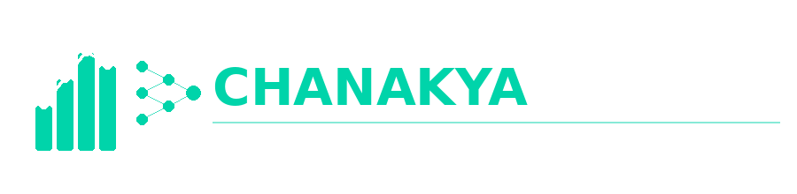

# CHANAKYA — AI Commerce Intelligence Platform

### *"Data is the new Arthashastra. CHANAKYA masters both."*

<br/>

[](https://chanakya-ai.streamlit.app)
[](https://github.com/DeveshShukla23)
[](https://www.linkedin.com/in/devesh-shukla23)

<br/>


</div>

---

## 🤔 What if you could build an entire Data Science ecosystem from scratch?

No Kaggle datasets. No YouTube tutorials. No shortcuts.

Just **raw Python**, **real business logic**, and **12 layers** of pure Data Science.

That's **CHANAKYA** — a 100% original end-to-end AI Commerce Intelligence Platform built on a **synthetically generated Indian e-commerce dataset** with real brands, real cities, real business patterns.

---

## 📊 The Numbers Speak

<div align="center">

| 🛒 Orders | 👥 Customers | 💰 Revenue | 📦 Products | 🏙️ Cities |
|-----------|-------------|-----------|------------|----------|
| **5,010** | **1,000** | **₹2.67 Crore** | **50 Indian Brands** | **28 Cities** |

</div>

---

## 🖥️ Streamlit Live App

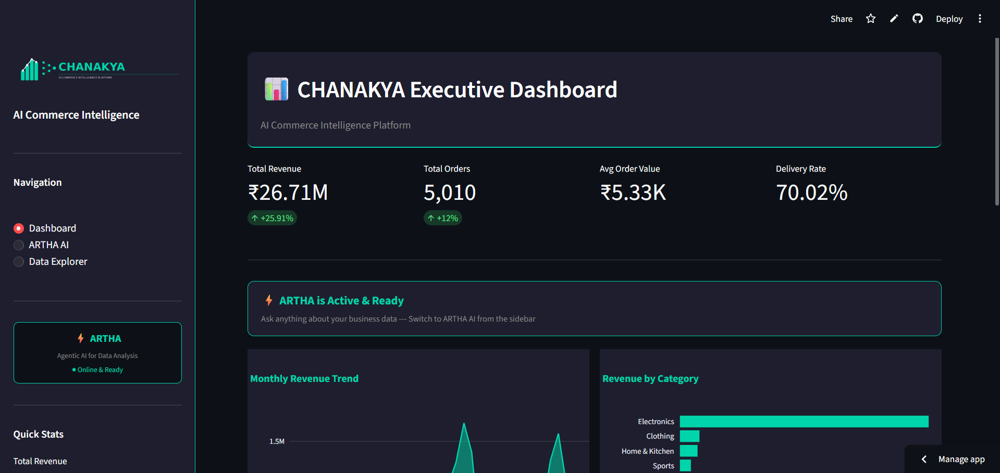

---

## 🤖 ARTHA — Agentic AI with Auto Visualizations

> *Named after Kautilya's Arthashastra — the ancient treatise on wealth and governance*

ARTHA doesn't just answer questions. It **thinks**, **analyzes**, and **visualizes** — all in real time.

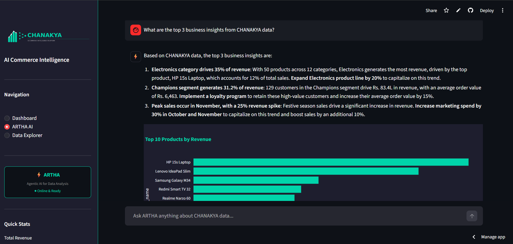

---

## 📊 Power BI Executive Dashboard

> Dark theme | 6 KPIs | 5 Visuals | 7 DAX Measures | 3 Interactive Slicers

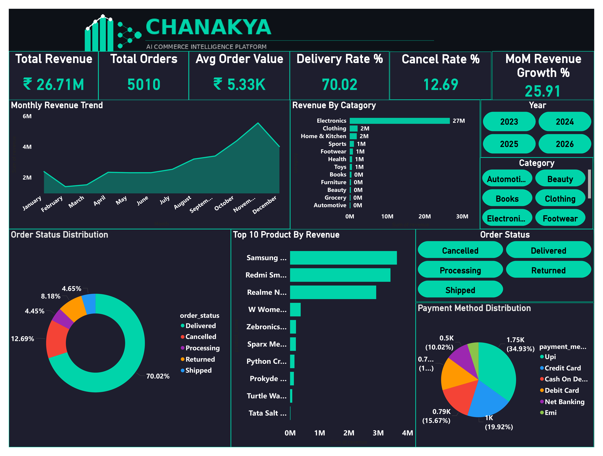

---

## 📈 Exploratory Data Analysis — Layer 4

> 16 professional charts revealing real business insights

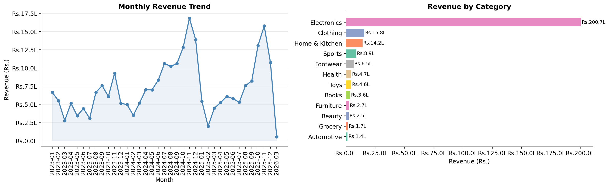

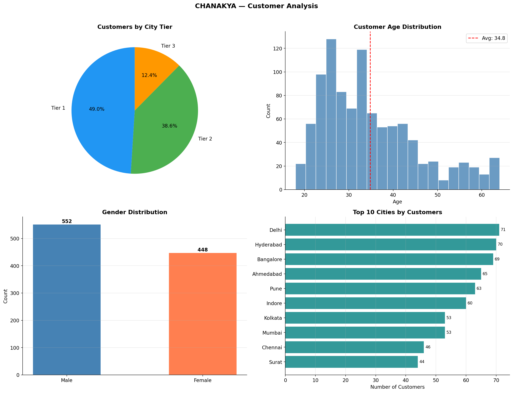

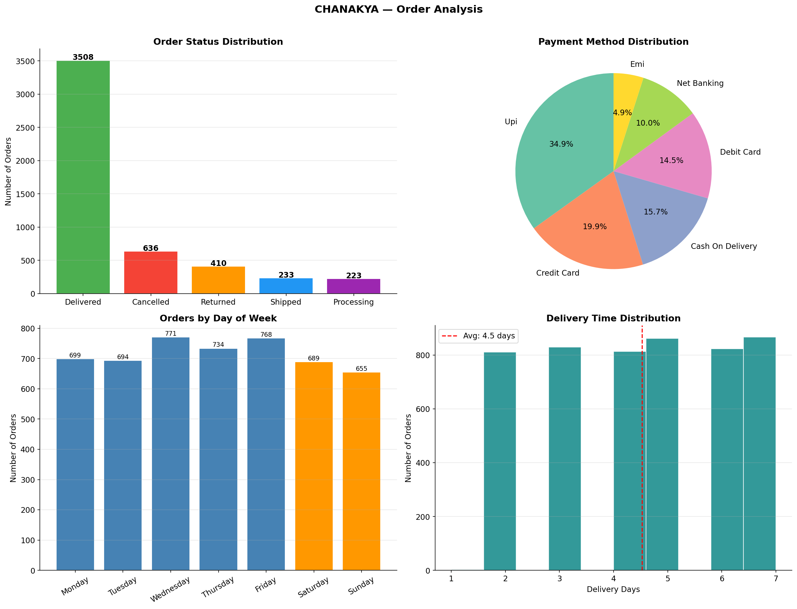

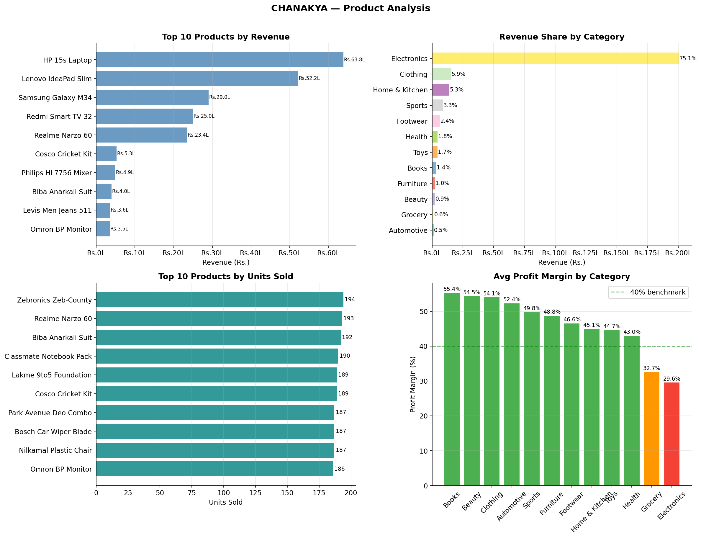

---

## 🎬 RFM Customer Segmentation — Layer 5

> 9 customer segments | Animated visualization

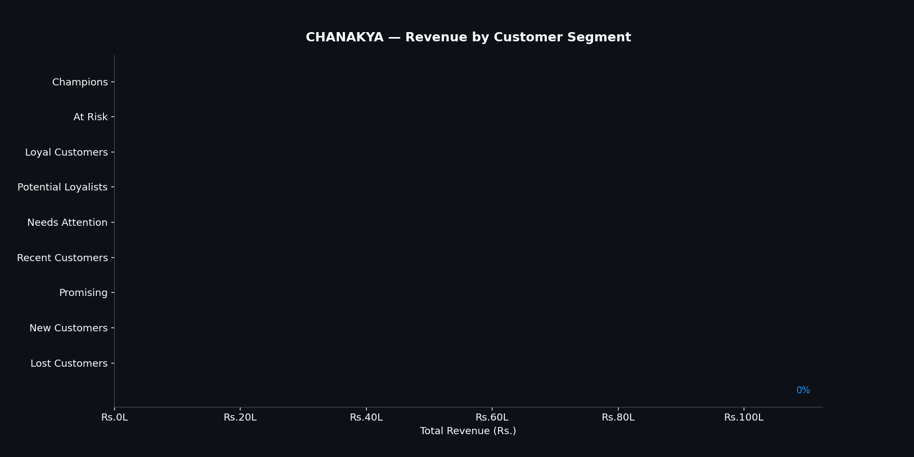

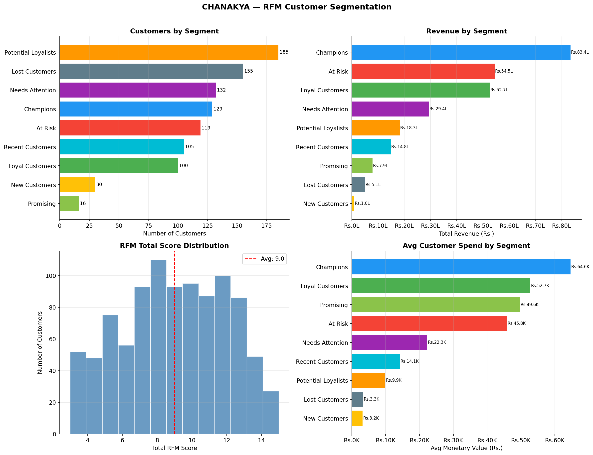

---

## 🚨 Anomaly Detection — Layer 6

> 34 fraud accounts caught using Z-Score + Isolation Forest

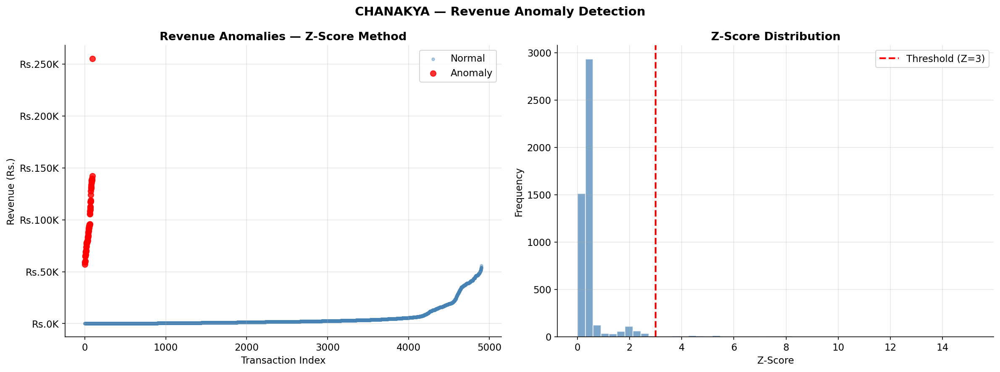

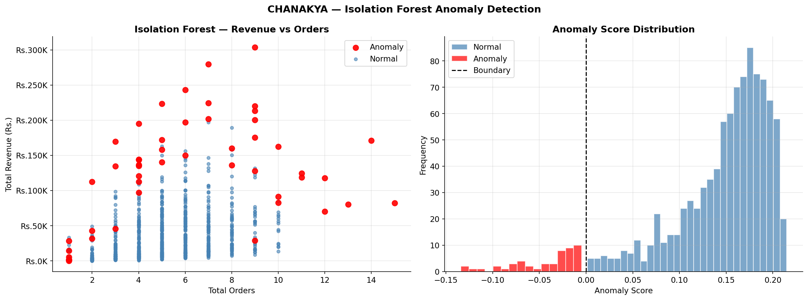

---

## 🤖 ML Demand Forecasting — Layer 7

> 4 models compared | Gradient Boosting wins with R2: 0.2891

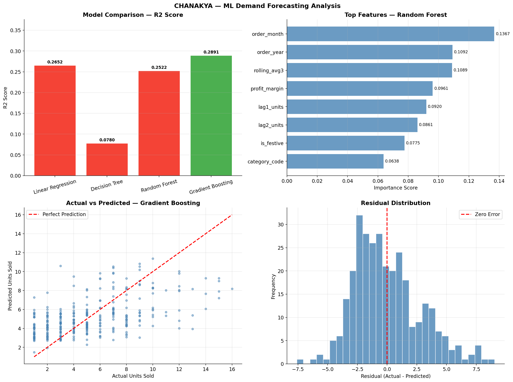

---

## 🧠 Deep Learning LSTM — Layer 8

> Time series revenue forecasting with TensorFlow

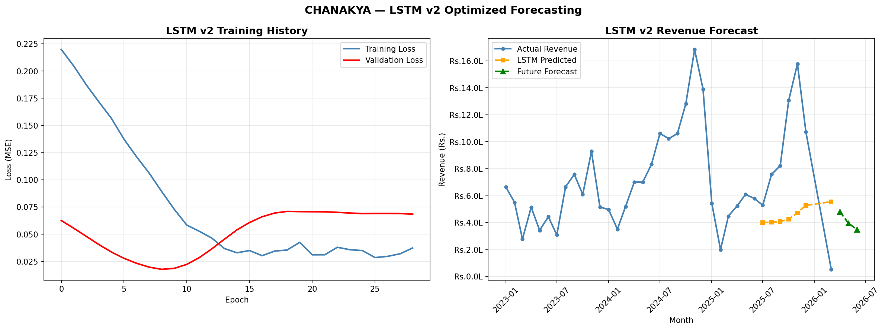

---

## 📉 Churn Prediction — Layer 9

> 477 at-risk customers identified | Data leakage detected & fixed

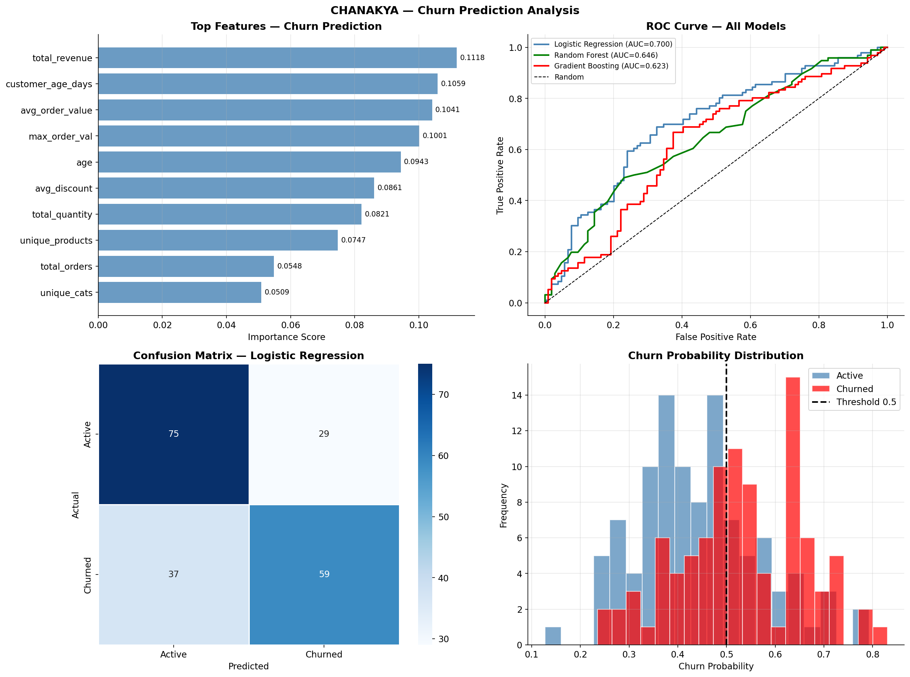

---

## 💡 Key Business Insights
```
📈  Electronics drives 75% revenue — but has the LOWEST profit margin
🏆  129 Champion customers generate ₹83.4L — top 13% = 31% revenue
⚠️  34 fraud accounts detected using Z-Score + Isolation Forest
📉  477 customers predicted to churn — before they actually left
🎯  November is peak month — festive season spike clearly visible
💳  UPI dominates at 34.9% — Digital India is real
```

---

## 🏗️ 12 Layers of Pure Data Science
```
┌─────────────────────────────────────────────────────────────┐
│                     CHANAKYA ECOSYSTEM                       │
├──────┬──────────────────────────┬───────────────────────────┤
│ L1   │ Data Source + Simulation │ 5,010 live orders         │
│ L2   │ ETL Pipeline             │ Production-grade logging  │
│ L3   │ SQL Data Warehouse       │ Star Schema + 7 queries   │
│ L4   │ EDA                      │ 16 professional charts    │
│ L5   │ RFM Segmentation         │ 9 segments + animation 🎬 │
│ L6   │ Anomaly Detection        │ 34 frauds caught          │
│ L7   │ ML Demand Forecasting    │ Gradient Boosting wins    │
│ L8   │ Deep Learning LSTM       │ Time series forecasting   │
│ L9   │ Churn Prediction         │ 477 at-risk customers     │
│ L10  │ Power BI Dashboard       │ Dark theme + DAX measures │
│ L11  │ ARTHA Agentic AI         │ LLaMA 3.3 70B via Groq    │
│ L12  │ Streamlit Deployment     │ Live on the internet      │
└──────┴──────────────────────────┴───────────────────────────┘
```

---

## 🔬 Technical Depth

### SQL — 8 Concepts Used
```sql
WITH customer_ltv AS (
    SELECT customer_id, SUM(revenue) as lifetime_value,
    RANK() OVER (ORDER BY SUM(revenue) DESC) as ltv_rank
    FROM fact_order_items GROUP BY customer_id
)
SELECT * FROM customer_ltv ORDER BY lifetime_value DESC;
```

### ML — 4 Models Compared
```
Linear Regression    → R2: 0.2652
Decision Tree        → R2: 0.0780
Random Forest        → R2: 0.2522
Gradient Boosting    → R2: 0.2891 ✅ WINNER
```

### Data Leakage — Detected & Fixed
```
v1 with days_since_last  → 100% accuracy ❌ (LEAKAGE!)
v2 without leakage       → 67% accuracy  ✅ (HONEST)
```

---

## 🚀 Tech Stack
```
Language      : Python 3.11
Database      : MySQL (Star Schema)
ML Libraries  : Scikit-learn, TensorFlow, Keras
Data          : Pandas, NumPy, Faker (Indian locale)
Visualization : Matplotlib, Seaborn, Plotly, Power BI
AI Model      : LLaMA 3.3 70B via Groq API
Frontend      : Streamlit
Deployment    : Streamlit Cloud
Security      : python-dotenv
Version Ctrl  : Git + GitHub
```

---

## ⚡ Run Locally
```bash
git clone https://github.com/DeveshShukla23/CHANAKYA.git
cd CHANAKYA
pip install -r layer12_streamlit_api/requirements.txt
echo "GROQ_API_KEY=your_groq_key_here" > layer12_streamlit_api/.env
cd layer12_streamlit_api
streamlit run app.py
```

---

## 👨‍💻 Author

<div align="center">

**Devesh Shukla**
*Data Analyst | Data Scientist | Builder*

*6 months internship experience | Passionate about turning data into decisions*

[](https://www.linkedin.com/in/devesh-shukla23)
[](https://github.com/DeveshShukla23)
[](https://chanakya-ai.streamlit.app)

</div>

---

<div align="center">

*"Most people download a dataset. I built one."*

**CHANAKYA** — Built with passion, data, and Arthashastra wisdom 🏛️

⭐ Star this repo if you found it useful!

</div>
